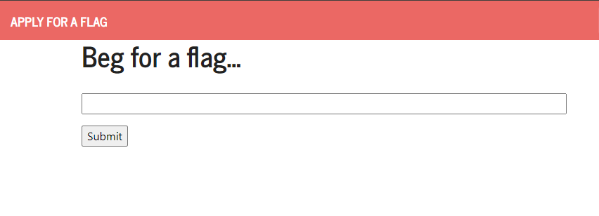
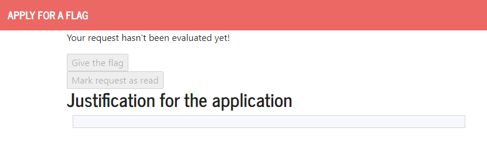
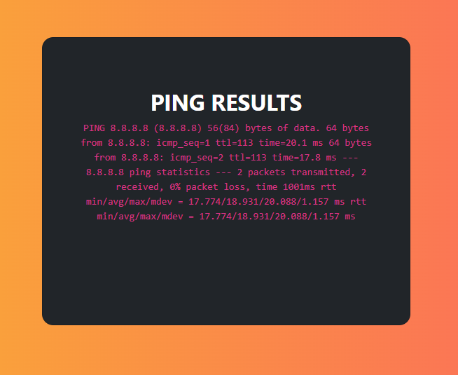
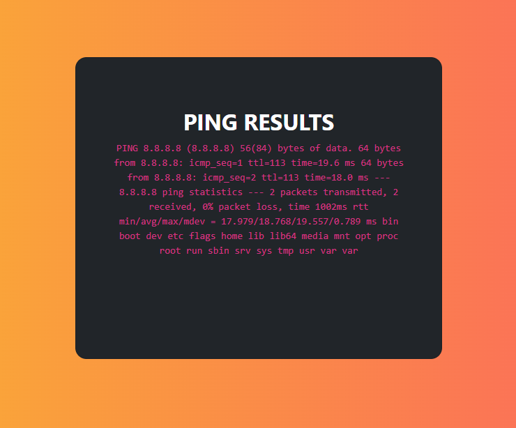
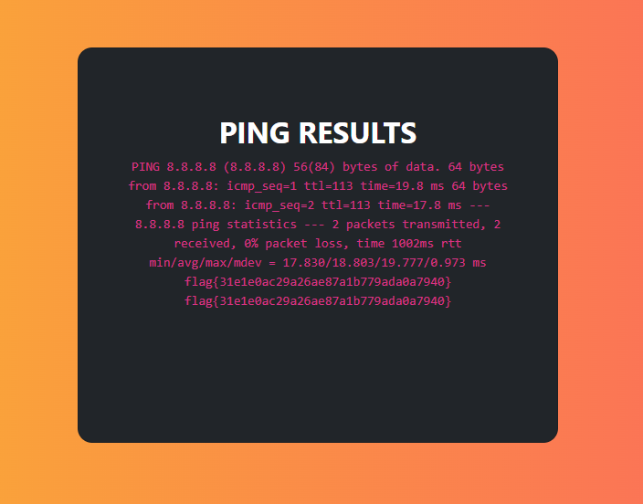

# CTF

### Challenge 1

- Here we have a page in which we need to give a reason for an admin to give us the flag. An admin has acess to two buttons "Mark request as read" and "Give the flag".

- Using the justification input form we can do a XSS attack by passing it a script that will be ran by the web app.

- By sending the input ````, when the admin opens the page of the request, the "Give the flag" button will be pressed, allowing us to see the flag.

### Challenge 2

- Of the available features to non-authenticated users, the one that stands out is the ping a host option.

- We can see by the output of the ping that it is likely using a bash or terminal to run the command.

- So by sending an ip followed by ``;``, we can run any command in the system. 

- To look for the the flag, we start by using ``ls``, until we find the ``flags`` directory. After this, we can just send ``8.8.8.8;cat /flags/flag.txt`` and this will print the flag in the output.
