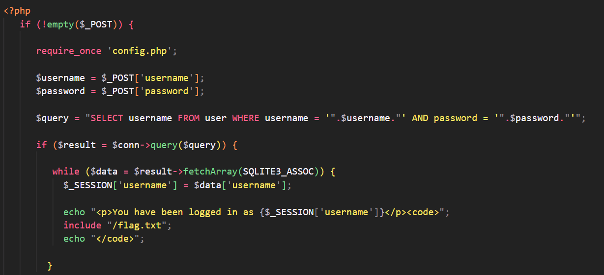
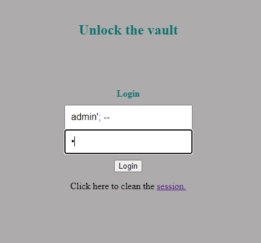
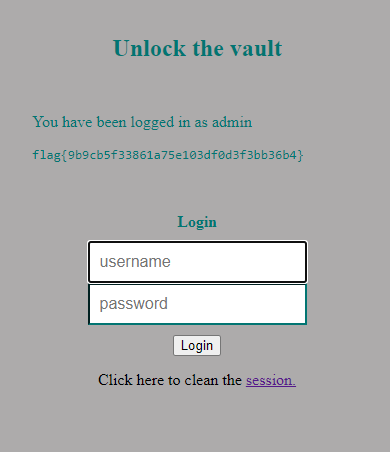

# CTF

### Challenge 1
- The objective of this challenge is to login using the admin user account in a web server in PHP. To do this, we are given access to the source code that is used by the server to interact with the database.

- Looking at the index.php file, we can see the query used for a user login: ``$query = "SELECT username FROM user WHERE username = '".$username."' AND password = '".$password."'" ``.

- The query used can be exploited in a way that it logs any user while ignoring the password requirement.

- We start the input for username with ``admin``, because this is the account we are looking for, and follow it with a `` ' `` to finish the evaluation of ``.$username.`` and a ``;`` to finish the query.

- To finish we add a ``--`` to comment out the password check. This way we end up with ``admin'; -- ``.
